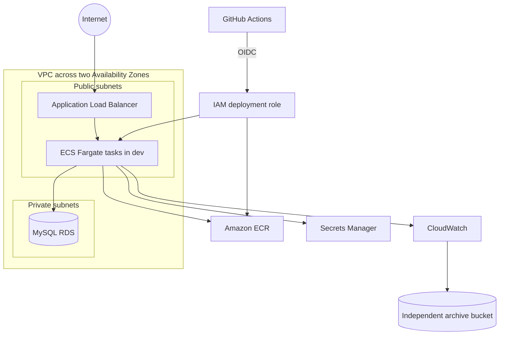

# AWS Architecture

## Regional topology

The Terraform stack targets AWS Mumbai. Networking spans two Availability Zones and creates public and private subnets, route tables, an internet gateway, and scoped security groups.

## Core services

| Service | Responsibility |
|---|---|
| VPC | Network isolation and routing |
| ALB | Public entry point and readiness-based target routing |
| ECS Fargate | Managed application and backup task execution |
| ECR | Versioned container image registry |
| RDS MySQL | Managed relational database in private subnets |
| Secrets Manager | Managed database credentials |
| KMS | Encryption for platform resources where configured |
| CloudWatch | Application logs, VPC flow logs, metrics, and autoscaling alarms |
| S3 | Persistent versioned log and portable SQL archive |
| IAM and OIDC | Least-privilege workload and deployment identity |

## Security groups

- The ALB accepts the configured public listener traffic.
- The ECS task security group accepts port 8080 only from the ALB security group.
- The RDS security group accepts port 3306 only from the task security group.
- Task egress is limited to DNS, HTTPS, and MySQL paths needed by the workload.

## Scaling

Development target tracking uses average ECS service CPU with a 60 percent target, minimum one task, and maximum two tasks. The test proved scale-out and scale-in. Production values can use a higher minimum and maximum based on availability and measured capacity.

## Persistent archive

The archive stack owns one private S3 bucket independently from dev and prod. It blocks public access, requires secure transport, enables versioning, uses AES256 server-side encryption, expires log objects after 30 days, expires portable backups after 90 days, and refuses automatic deletion of a non-empty bucket.

## HTTPS decision

The dev ALB used HTTP for temporary validation. A trusted ACM public certificate requires domain validation, so production should use a controlled domain, an ACM certificate, an HTTPS listener, and an HTTP-to-HTTPS redirect. The lack of a domain was treated as a documented environment constraint rather than bypassed with an untrusted certificate.
