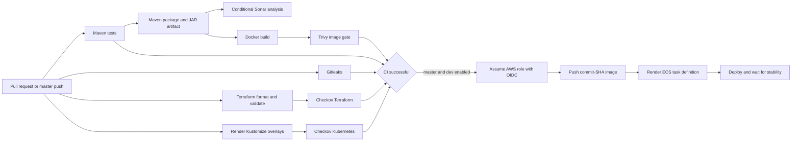

# CI CD Flow

## Pipeline overview

## CI behavior

Pull requests and pushes to `master` run CI. Maven tests must pass before packaging. The JAR is uploaded as a workflow artifact. Gitleaks scans full Git history. Terraform is formatted, initialized without a backend, and validated for the reusable root and environments. Checkov scans Terraform and rendered Kubernetes overlays. Docker image creation must succeed, and Trivy blocks fixable high or critical image vulnerabilities.

Sonar analysis is present but runs only when its token exists. Because the workflow does not demonstrate mandatory quality-gate enforcement, documentation treats it as conditional.

## CD behavior

The CD workflow starts only after successful CI on `master`, or through an approved manual dispatch on `master`. `DEV_INFRA_ENABLED` must equal `true`; otherwise the job skips. This prevents a successful CI run from trying to deploy into a deliberately destroyed environment.

The workflow requests short-lived AWS credentials using OIDC, logs in to ECR, tags the image with the source commit SHA, pushes it, downloads the current ECS task definition, replaces the container image, deploys the new revision, and waits for service stability.

## Rollback and failure handling

ECS deployment circuit-breaker settings and service-stability waiting detect failed rollouts. Operators inspect ECS events, task logs, target health, and the task-definition revision. Recovery uses the last known-good immutable image and task revision. CI failures prevent CD from starting.

## Future improvements

- Enforce a Sonar quality gate instead of only running analysis.
- Add dynamic application security testing with OWASP ZAP.
- Add Snyk only if it provides value beyond existing dependency and image controls.
- Add deployment notifications without exposing scan output or secrets.
