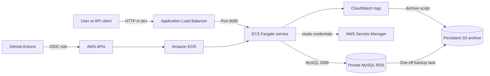

# High Level Architecture

## Purpose

The final architecture runs one Spring Boot service on AWS ECS Fargate. It separates internet traffic, application execution, database access, delivery automation, observability, and persistent recovery evidence.

## Trust boundaries

- The public boundary ends at the ALB. ECS tasks accept application traffic only from the ALB security group.
- RDS remains in private subnets and accepts MySQL traffic only from the application and backup-task security context.
- GitHub does not store long-lived AWS access keys. The CD workflow requests short-lived credentials through OIDC.
- Secrets Manager holds database credentials. Neither Terraform source nor GitHub workflows contain the password.
- The archive stack uses independent Terraform state so environment teardown does not delete retained evidence.

## Deployment boundaries

Terraform owns foundational infrastructure and the baseline ECS task definition. CI/CD owns deployed image revisions. Application Auto Scaling owns the ECS desired count while enabled. Terraform ignores task-definition and desired-count drift that belongs to those systems.

## Availability and cost

The VPC spans two Availability Zones. The dev design avoids a NAT gateway and assigns public task IPs while security groups restrict inbound traffic. Production configuration uses private tasks, NAT, stronger RDS resilience, HTTPS, and longer retention. This distinction keeps the demonstration affordable without presenting dev shortcuts as production defaults.
