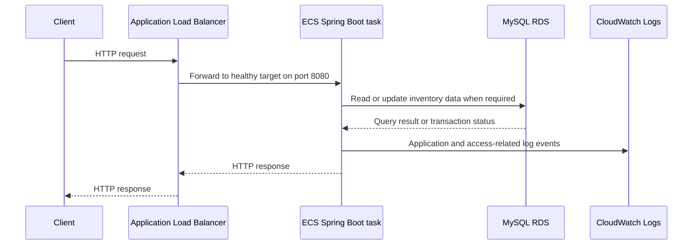

# Application Request Flow

## Request path

## Functional areas

The application exposes behavior for inventory items, members, purchase orders, recommendations, receipts, and sales analysis. Exact endpoint paths remain documented in `ai-specifications/application-spec.md`; this architecture document does not invent additional routes.

## Health checks

The ALB calls the Spring Boot readiness endpoint. ECS replaces unhealthy tasks, and the ALB sends client requests only to registered healthy targets. A successful validation returned HTTP 200 with status `UP`.

## Failure points

- DNS or listener problems prevent the client from reaching the ALB.
- An unhealthy target or incorrect security-group rule prevents forwarding.
- Task startup, image, secret, or application failures appear in ECS events and CloudWatch logs.
- Database connectivity failures appear in application logs and may fail readiness depending on health configuration.
- Scaling may temporarily show pending tasks while Fargate starts additional capacity.

## Logging

Application logs go to CloudWatch. VPC flow logs provide network-level evidence. The archive script reads CloudWatch events, compresses JSON output, and uploads it to the persistent S3 `logs/` prefix.
