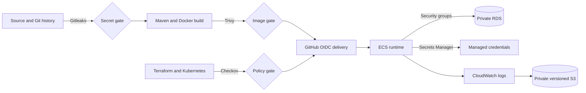

# Security Flow

## Layered controls

## Blocking controls

- Maven test failures block packaging.
- Gitleaks findings block CI.
- Terraform formatting or validation failures block CI.
- Checkov findings block CI except explicitly documented, reviewed exceptions.
- Trivy blocks fixable high and critical image vulnerabilities.
- Docker build failures block the image path.
- Unsuccessful CI prevents automatic deployment.

## Identity and secrets

GitHub Actions uses `id-token: write` only in CD and assumes a scoped IAM role. ECS uses separate execution and task roles. Database credentials remain in Secrets Manager. Documentation never includes password values, AWS access keys, tokens, webhook URLs, or the managed secret value.

## Data protection

RDS, ECR, CloudWatch resources where configured, and platform secrets use encryption. S3 blocks public access, denies insecure transport, enables versioning, and applies server-side encryption. The archive uses independent state to prevent accidental loss during dev teardown.

## Exceptions

Checkov exceptions require an inline rationale tied to the environment or an acknowledged tooling limitation. Dev HTTP, shorter retention, and cost-conscious database settings are not production defaults. Future production work must review all exceptions again.
